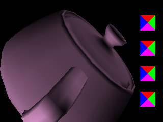
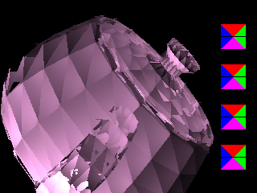

# __Report - HW2__

### Chad Weatherly

__Problem__

For homework 2, the problem was to re-create the GzFrameBuffer class in C++, except now the GzFrameBuffer should have the ability to draw triangle primitives using the Scan Line algorithm.

__Method__

For my method, I first created a new structure in GzCommomon, ```GzTriangle```, which takes in 3 vertices (```GzVertex```) and their corresponding color values (```GzColor```). ```GzTriangle``` then sorts them from lowest x-value >> highest x-value, so that when calculating slopes, it's easier. It then calculates the minimum and maximum x- and y-values (4 total). Finally, it calculates the slope of the line connecting each set of vertices (3 total). This is used as part of GzFrameBuffer. 

I then re-created the GzFrameBuffer class with the following methods (new methods/attributes to HW2 are bold):

- ```initFramSize()``1, which takes in width and height values and initializes the buffer screen with these dimensions.
- ```toImage```, which outputs the buffer as a ```GzImage``` object.
- ```clear```, which clears the buffer screen at z-value ```clear_depth``` or lower with the ```clear_color```.
- ```setClearColor```, which sets the ```clear_color``` attribute with an input ```GzColor``` object.
- ```setClearDepth```, which sets the ```clear_depth``` attribute with an input ```GzReal``` (float) object.
- ```get_depth```, which gets the depth of the buffer image at entry (x, y).
- ```set_depth```, which sets the depth of the buffer image at entry (x, y) with value z.
- __```get_width```__, which returns the pixel width of the buffer size
- __```get_height```__, which returns the pixel height of the buffer size
- ```drawPoint```, the essential function of GzFramBuffer. Once the frame buffer is initialized, individual pixels are updates with ```drawPoint``` at pixel (x, y) with a specified color and given a depth-value at that pixel, if the depth (z-value) of the new vertex is greater than the current pixel depth at (x, y). If not, then the pixel is left unchanged.
- __```find_intersection```__, which, given a point (x1, y1) on a line with slope m and a y value, calculates at which point x would make it so that (x, y) is on the same line. 
- __```MapToPixels```__, disregard. Implemented to fix an error but then not used because the error was caused by something different.
- __```drawTriangle```__, takes in 3 vertices and 3 colors, and draws the corresponding triangle onto the frameBuffer image. More implementation details are below.

Along with the methods, the following private attributes were also added:

- ```GzInt w```, the width of the image frame.
- ```GzInt h```, the height of the image frame.
- ```GzColor clear_color```, the RGBA color value used to clear the buffer below the z-value ```clear_depth```.
- ```GZInt clear_depth```, the z-value used to clear the frame buffer
- ```GzImage internal_buffer```, the image buffer that is constantly updated with the methods above.
- ```vector<vector<GzInt> > pixel_depth```, a 2D vector that keeps track of the depth at each pixel location.

The GzFrameBuffer class essentially has two main types of actions, initialize/clear and drawing a point.

When the buffer is initialized, it automatically creates and clears the image frame. After initialization, the image frame can be cleared again with different colors or to different depths. 

Drawing a point is the essential part of the class, as it is actually doing the work of drawing given colors on the given vertices by the Gz class. This image is constantly updated as Gz passed new vertices and colors to GzFrameBuffer.

__```GzFrameBuffer::drawTriangle```__

When drawing triangles, a single triangle with 3 vertices and 3 colors is passed to drawTriangle. The scanline is implemented loosely following these steps:

1. Bound triangle to box where x : [x_min, x_max] and y : [y_min, y_max]
2. Scan a horizontal line through each y-value in [y_min, y_max]
3. If there are two intersections of the scan line to the triangle, then fill in the x-values on that y-value scanline with interpolated z and color values

This works well, it iterates through each triangle, then through each line of the triangle to fill in the colors. 

__Implementation__

This class and all of its methods were coded in C++, with the initial declaration of the class and its methods/attributes in the GzFrameBuffer.h file, then implemented in GzFrameBuffer.cpp.

After the coding was done, compiling was done through the terminal, as I am coding on MacOS with an M2 max chip on VS code. Currently, VS code struggles to compile and link files, but this was circumvented using the terminal. From the HW1 directory, the below code was used to compile the program to an executable object, hw1.exe:

```zsh
clang++ src/main.cpp src/Gz.cpp src/GzImage.cpp src/GzFrameBuffer.cpp -o hw2
```

For using G++:

```zsh
g++ src/main.cpp src/Gz.cpp src/GzImage.cpp src/GzFrameBuffer.cpp -o hw2
```

As I am new to C++, I was not able to create a makefile to compile, but the above code should work fine on any machine. Also, the hw2.exe file is included in this directory, and can also be run using ./hw2 after compiling.

__Results__

The algorithm was able to render a similar image to the one provided. The only issue I had was with the colors and z-values. Because the z-values and colors vary for different vertices on several of the triangles, the interpolated values for z and colors tend to cause some aliasing, but the shape is still identifiable, which can be seen below. The first image is the one provided by TA (TeaPot_ex.bmp), while the second image is the one rendered by my program (TeaPot.bmp).




