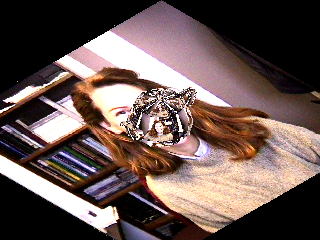
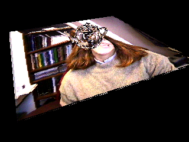
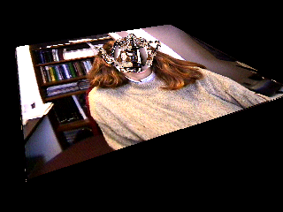

# __Report - HW5__

### Chad Weatherly

__Problem__

For homework 5, the problem was to implement texturing into the Gz library.

__Method__

For main.cpp, I only updated the filepath for images to be saved within a newly created "output" folder.

Within Gz, a couple methods were added, mainly to be passed to frameBuffer:

- ```texture```, which takes the saved texture image and passes it to frameBuffer
- ```addTexCoord```, which adds corresponding texture coordinates for the given vertices to TexCoordQueue.

Also, the ```end``` was updated to inluded texturing. I made sure to keep track of which projection was used (orthographic vs. projection), and this was passed to frameBuffer.

Within GzFrameBuffer, most of the work was done. It is simpler to talk about the main ideas than iterate through each method. The texturing is first updated in ```end``` so that the vertices (v1, v2, v3) are matched with their corresponding texture coordinates (uv1, uv2, uv3). This was done using new methods that have similar structures to previous methods: ```drawTexTriangle``` and ```drawTexScanline```. Within ```drawTexScanline```, the computations are done, rasterizing each line across a given triangle and matching that with the correct pixels of the texture image. A new method, ```TriangleArea``` was created, both to find out if a given point was within the triangle using [Heron's Method](https://www.geeksforgeeks.org/check-whether-a-given-point-lies-inside-a-triangle-or-not/) and also then to have weights for finding barycentric coordinates and interpolating values for texture coordinates and z-values of each pixel.

As part of the scanline method, the distinction between orthographic and perspective projection was implemented. If an orthographic projection was used, then the texture image coordinates are interpolated using the aforementioned weights. If perspecive projection was used, then the texture coordinates go through perspective correction, which involves scaling each texture coordinate by it's corresponding z-value, then interpolating across the texture space, and finally restoring this interpolated value by unscaling it with the total weight reciprocal of the interpolated z-value.

__Implementation__

The classes and all of its methods were coded in C++.

After the coding was done, compiling was done through the terminal, as I am coding on MacOS with an M2 max chip on VS code. Currently, VS code struggles to compile and link files, but this was circumvented using the terminal. From the HW5 directory, the below code was used to compile the program to an executable object, hw1.exe:

```zsh
clang++ src/main.cpp src/Gz.cpp src/GzImage.cpp src/GzFrameBuffer.cpp src/GzImage.cpp src/GzMatrix src/GzVector.cpp -o hw5
```

For using G++:

```zsh
g++ src/main.cpp src/Gz.cpp src/GzImage.cpp src/GzFrameBuffer.cpp src/GzImage.cpp src/GzMatrix src/GzVector.cpp -o hw5
```

As I am new to C++, I was not able to create a makefile to compile, but the above code should work fine on any machine. Also, the hw5.exe file is included in this directory, and can also be run using ./hw5 after compiling.

__Results__

I took some time to really understand the projections and transformations, as well as what they were doing. Because of this, I was able to pretty successfully code this assignment and have valid results. Below are my outputs compared with the given outputs by the TA:

### Orthographic Projection (TeaPot1)

My results            |  Given results
:-------------------------:|:-------------------------:
  |  

As you can see, my results for the first Teapot were pretty identical to the given Teapot, with variations most likely accounted for in small differences in interpolation methods.

### Perspective Projection (TeaPot2)

My results            |  Given results
:-------------------------:|:-------------------------:
  |  

For TeaPot 2, I struggled a bit to get the perspective correction right. I tried many different methods based on different sources, but all seemed to be slightly distorted compared to the original image.
